# Flex

> 参考教程  
1.[阮一峰 - Flex 布局教程：语法篇](http://www.ruanyifeng.com/blog/2015/07/flex-grammar.html)  
2.[阮一峰 - Flex 布局教程：实例篇](http://www.ruanyifeng.com/blog/2015/07/flex-examples.html)  
3.[uolcano -【CSS趣味】flex 缺省的 auto 跟 0 到底有何区别](https://segmentfault.com/a/1190000004288826#articleHeader0)  
4.[Dimitar Stojanov - A Visual Guide to CSS3 Flexbox Properties](https://scotch.io/tutorials/a-visual-guide-to-css3-flexbox-properties)  
5.[CSS Tricks - A Complete Guide to Flexbox
](https://css-tricks.com/snippets/css/a-guide-to-flexbox/)  
6.[W3C - CSS Flexible Box Layout Module Level 1](https://www.w3.org/TR/css-flexbox-1/)  

问题点：
1. flex缩写所代表的含义
2. 宽度在内容过多时如何展示
3. 坑: jusitfy-content居中最后一行左对齐问题  
4. flex基础属性之外的疑难点，对比固定宽度或宽度百分比的优劣，自由伸缩不全是好的
5. flex: 0;  1 ; none;等的具体含义

flex布局相比以前display+position+float的方案更加简单灵活，可以简便地实现水平垂直居中，两端对齐等。 

## flex容器

> 设为 Flex 布局以后，子元素的float、clear和vertical-align属性将失效。

设置span元素为inline-flex时，其拥有inline-block的属性

```css
.box{
  display: flex | inline-flex
}
```

## 容器属性

```none
// 容器属性
flex-direction / flex-wrap / flex-flow / justify-content / align-items / align-content
```

### 1.flex-direction
```
.box { flex-direction: row | row-reverse | column | column-reverse; }
```
* 有趣的地方
容器设置高度时，flex-direction: column从容器顶部向下竖向排列，溢出在容器下方
flex-direction: column-reverse; 从容器底部向上竖向排列，溢出在容器上方

```
容器设置高度时，flex-direction:column可以溢出容器
.ct{
  display: flex;
  height: 300px;
  flex-direction: column;
}
```
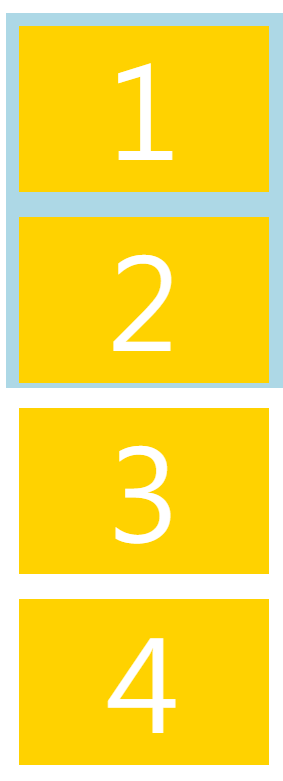

```
容器设置高度时，flex-direction:column-reverse
.ct{
  display: flex;
  height: 300px;
  flex-direction: column-reverse;
}
```
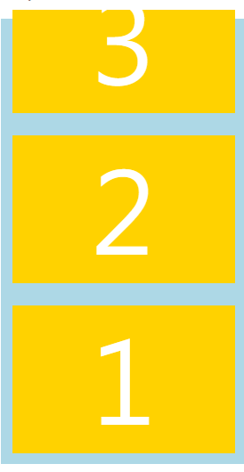

### 2.flex-wrap

```
flex-wrap: nowrap(默认，不换行) | wrap换行 | wrap-reverse第一行在下方;
```
flex-wrap: nowrap不换行，空间不够出现滚动条
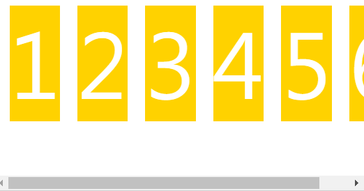


### 3.flex-flow

```
// 缩写
.box { flex-flow: <flex-direction> || <flex-wrap>; }
```

### 4.justify-content

```
.box { justify-content: flex-start | flex-end | center | space-between | space-around; }
```

### 5.align-items
```
.box { align-items: flex-start | flex-end | center | baseline | stretch; }
```
align-items默认值为stretch，如果项目未设置高度或高度为auto，将占满整个容器的高度


### 6.align-content
```
.box { align-content: flex-start | flex-end | center | space-between | space-around | stretch; }
```
多行的对齐方式，justify-content控制主轴，align-items控制每行项目的内容，align-content控制行之间的排列

默认stretch，会占满交叉轴的空间
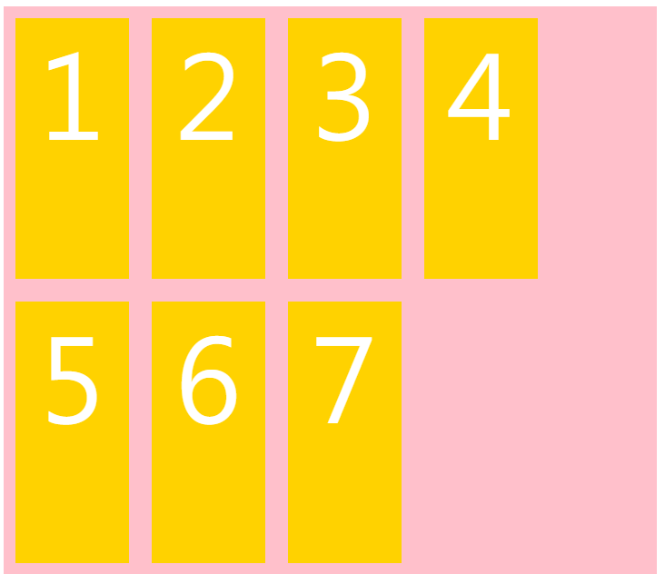

space-between：与交叉轴两端对齐，轴线之间的间隔平均分布。
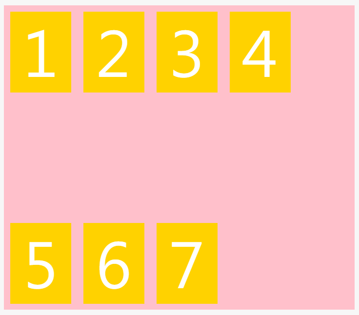


## 项目属性

```
// 项目属性
order / flex-grow / flex-shrink / flex-basis / flex / align-self
```

### 1. order
order属性定义项目的排列顺序。数值越小，排列越靠前，默认为0。
```
.item { order: <integer>; }
```
### 2. flex-grow

flex-grow属性定义项目的放大比例，**默认为0，即如果存在剩余空间，也不放大。**  
如果有数值，则按number等分；

```
.item { flex-grow: <number>; /* default 0 */ }
```

```
.item1{
  flex:1  // 1/(1+2)
}
.item2{
  flex:2  // 2/(1+2)
}
```
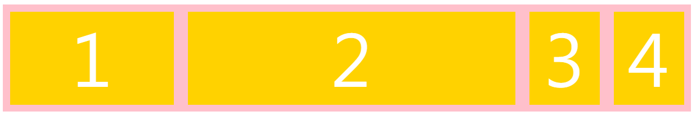


### 3. flex-shrink
flex-shrink属性定义了项目的缩小比例，**默认为1，即如果空间不足，该项目将缩小。**
* 计算超出的空间是计算边距的，但计算每份所占比例则是按第二条，width就是css中的width不包含边距
* 比例是按照flex-basis计算的，优先级为flex-basis > width > contentWidth  
如果没有设置flex-basis属性，那么flex-basis的大小就是项目的width属性的大小
如果没有设置width属性，那么flex-basis的大小就是项目内容(content)的大小
* 实际width还受文字换行影响，如连续文字未使用word-break: break-all是会强行在一行，从而撑开width

```
.ct{
  display: flex;
  width: 500px
}
.son{
  margin: 10px;
  width: 200px; // 实际为120px
}
.son:nth-child(1){
  width: 100px; 实际为60px;
}
```

#### 计算
1. 容器宽度: 500px;  
实际所需容器宽度: 100(item1) + 200 * 3(item2,3,4) + 10(margin) * 4 * 2 = 780px;   
缺少: 780-500 = 280px;  
默认每个flex-item为1 100 * 1 + 200 * 1 * 3 = 700;  
item1收缩 (100 * 1 / 700) * 280 = 40px;  
itme2,3,4 收缩 (200 * 1 / 700) * 280 = 80px;  
所以item1实际宽度 100 - 40 = 60px, item2,3,4实际宽度 200 - 80 = 120px

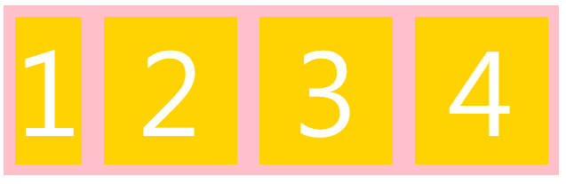

2. 假设item2的flex-shrink: 2;  
默认每个flex-item为1 100 * 1 + 200 * 2 * 1 + 200 * 1 * 2 = 900;  
item1收缩 (100 * 1 / 900) * 280 ≈ 31.11px;  
item2收缩 (200 * 2 / 900) * 280 ≈ 124.44px;  
itme3,4 收缩 (200 * 1 / 900) * 280 = 62.22px;  
所以item1实际宽度 100 - 31.11 = 68.89px, item2实际宽度 200 - 124.44 = 75.56px; item3,4实际宽度 200 - 62.22 = 137.78px  
查看控制台验证依然正确

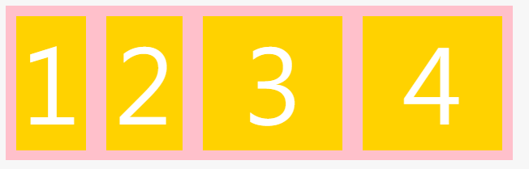

### 4.flex-basis
flex-basis属性定义了在分配多余空间之前，项目占据的主轴空间（main size）。浏览器根据这个属性，计算主轴是否有多余空间。它的默认值为auto，即项目的本来大小。

```
.item { flex-basis: <length>; | auto; /* default auto */ }
```
> [MDN](https://developer.mozilla.org/zh-CN/docs/Web/CSS/flex-basis) CSS 属性 flex-basis 指定了 flex 元素在主轴方向上的初始大小。如果不使用 box-sizing 来改变盒模型的话，那么这个属性就决定了 flex 元素的内容盒（content-box）的宽或者高（取决于主轴的方向）的尺寸大小。

### 5.flex
flex属性是flex-grow, flex-shrink 和 flex-basis的简写，默认值为initial(0 1 auto)。后两个属性可选。  
该属性有两个快捷值：auto (1 1 auto) 和 none (0 0 auto)。
```
.item { flex: none | [ <'flex-grow'> <'flex-shrink'>? || <'flex-basis'> ] }
```
flex-basis: 百分比是相对于容器空间的，0%表示item初始所占主轴空间为0；

flex: 0; => flex: 0 1 0%;  
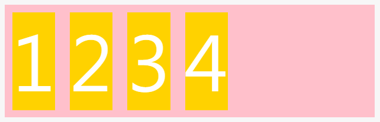

flex: 0 1 auto(initial);
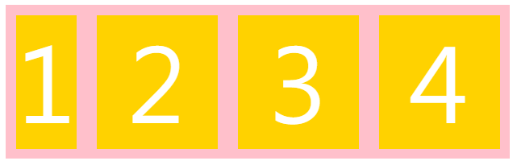

flex: 1; => flex: 1 1 0%;
flex: auto; => flex: 1 1 auto;

flex: none; => flex: 0 0 auto;

* flex: none;

```scss
// flex: none;

.ct{
  display: flex;
  flex-wrap: nowrap;
  justify-content: space-between;
  align-items: baseline;
  div {
    flex: none;
    border: 1px solid;
    color: red;
  }
}
```

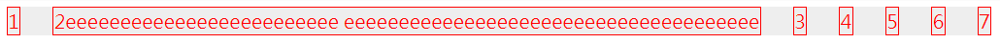

* flex: 0;

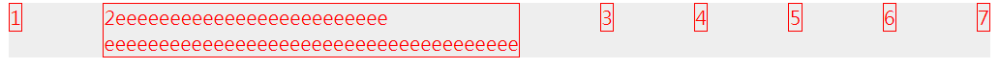

* flex: 1;

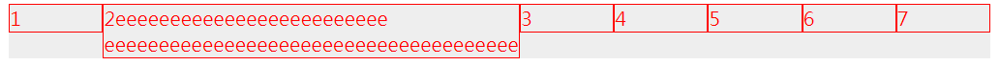


### 6.align-self
align-self属性允许单个项目有与其他项目不一样的对齐方式，可覆盖align-items属性。默认值为auto，表示继承父元素的align-items属性，如果没有父元素，则等同于stretch。

.item { align-self: auto | flex-start | flex-end | center | baseline | stretch; }

* flex-wrap: wrap; flex-basis: 100px;

```css
.ct{
  display: flex;
  flex-wrap: wrap;
  background: #eee;
  div {
    height: 100px;
    flex-basis: 100px;
    border: 1px solid;
    color: red;
  }
}
```
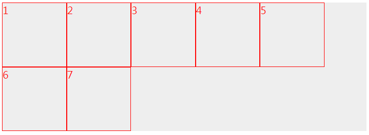

* 如果item项声明了width或flex-basis，同时flex容器设有


一长串不截断的字符串也会增加占用的空间，屏幕宽度缩到包不住所有item时，会出现滚动条, 此时可以word-break

```css
.ct{
  display: flex;
  flex-wrap: nowrap;
  background: #eee;
  justify-content: space-between;
  align-items: baseline;
  div {
    flex-basis: 100px;
    border: 1px solid;
    color: red;
  }
}
```
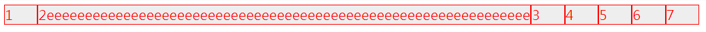

